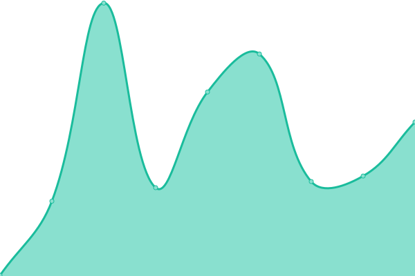

# [📈 Live Status](https://zinc-email.github.io/upptime): <!--live status--> **🟩 All systems operational**

This repository contains the open-source uptime monitor and status page for [Zinc Email](https://zinc.email/), powered by [Upptime](https://github.com/upptime/upptime).

With [Upptime](https://upptime.js.org), you can get your own unlimited and free uptime monitor and status page, powered entirely by a GitHub repository. We use [Issues](https://github.com/zinc-email/upptime/issues) as incident reports, [Actions](https://github.com/zinc-email/upptime/actions) as uptime monitors, and [Pages](https://zinc-email.github.io/upptime) for the status page.

<!--start: status pages-->
<!-- This summary is generated by Upptime (https://github.com/upptime/upptime) -->
<!-- Do not edit this manually, your changes will be overwritten -->
<!-- prettier-ignore -->
| URL | Status | History | Response Time | Uptime |
| --- | ------ | ------- | ------------- | ------ |
|  [Zinc Website](https://zinc.email/) | 🟩 Up | [zinc-website.yml](https://github.com/zinc-email/upptime/commits/HEAD/history/zinc-website.yml) | 

 350ms
     
 | 

<a href="https://zinc-email.github.io/upptime/history/zinc-website">100.00%</a>
    

|  [Zinc MTA (submission)](mail.zinc.email) | 🟩 Up | [zinc-mta-submission.yml](https://github.com/zinc-email/upptime/commits/HEAD/history/zinc-mta-submission.yml) | 

 40ms
     
 | 

<a href="https://zinc-email.github.io/upptime/history/zinc-mta-submission">100.00%</a>
    

<!--end: status pages-->

[**Visit our status website →**](https://zinc-email.github.io/upptime)

## 📄 License

- Powered by: [Upptime](https://github.com/upptime/upptime)
- Code: [MIT](./LICENSE) © [Zinc Email](https://zinc.email/)
- Data in the `./history` directory: [Open Database License](https://opendatacommons.org/licenses/odbl/1-0/)
